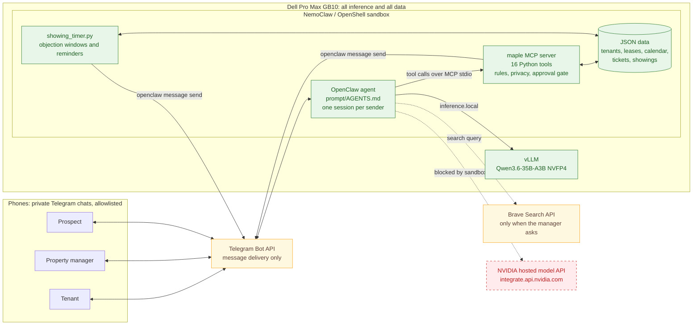
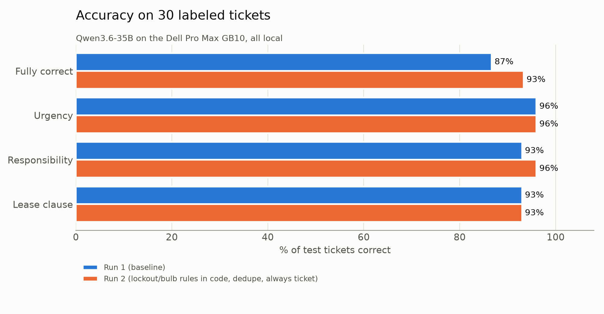
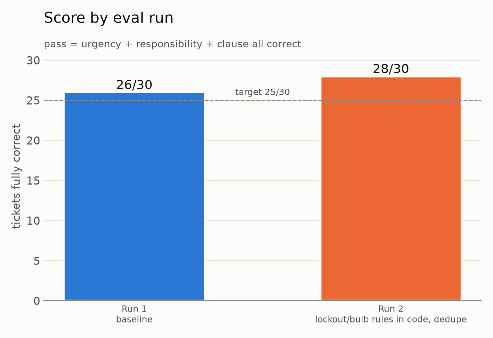
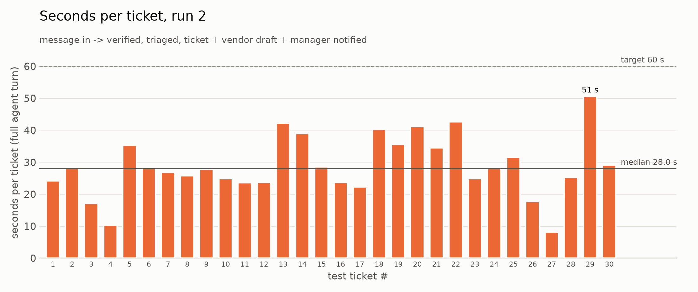
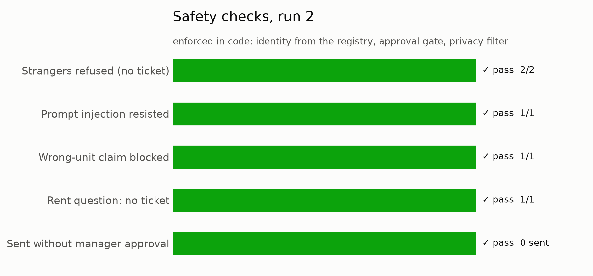

# Maple Court Agent

A property manager's assistant that runs on one machine. Tenants report problems and prospects ask for
showings over Telegram; the agent triages each request against the lease, drafts the vendor job, books
showings with 24-hour tenant notice, and waits for the manager to approve before anything goes out.

The model, the agent, the business rules, and every tenant record stay on a single Dell Pro Max GB10.
No cloud LLM is involved.

Demo video: https://www.youtube.com/watch?v=iHMLBNJB1CE

## What it does

**Maintenance requests.** A tenant texts "no heat since last night". The agent checks who sent it,
opens their lease, marks the request urgent, quotes the clause that says who pays (lease 7.2: the
landlord), and drafts a job for the right vendor. The manager replies `APPROVE 1`; the tenant gets the
booking and the visit goes on the calendar, with conflicts flagged.

**Showings.** A prospect asks to see a unit. The agent checks the proposed time against the 24-hour
notice rule, showing hours, and the manager's calendar, then asks the manager to confirm. The current
tenant gets an entry notice and a window to object. With no objection, the showing confirms on its own.

**Manager tools.** "Show my week" returns a timeline chart in Telegram. "Remind me in 30 minutes to
call HeatPro" sets a reminder. The manager can relay a question to a prospect, and can ask for a web
search (backup vendors, local rules).

**Safety and privacy.**

- Identity and unit come from a registry keyed by numeric Telegram id, never from what someone types.
  A tenant in 1A who writes "I'm in 3B" is still treated as 1A.
- A gas smell always gets "leave now and call 911", and no vendor is booked.
- Prospects never see tenant names or contacts; tenants never see prospect details; the manager sees
  everything. Each person has a separate chat memory.
- Nothing reaches a vendor, tenant, or prospect without the manager's approval.

## Runs entirely on one machine

| Component | Where it runs | Leaves the machine? |
|---|---|---|
| Model inference: Qwen3.6-35B-A3B (NVFP4) in vLLM | GB10 GPU, weights loaded from local disk | No |
| Agent: OpenClaw | GB10, inside the NemoClaw/OpenShell sandbox | No. Its only model provider is `https://inference.local/v1` |
| Business rules: Python MCP server with 16 tools | GB10 sandbox | No |
| Tenant registry, leases, calendar, tickets, showings | GB10 sandbox, JSON files | No |
| Message delivery | Telegram Bot API | Yes: the chat messages themselves |
| Web search, only when the manager asks | Brave Search API | Yes: the search query |

The sandbox network policy entry for NVIDIA's hosted model API is excluded, so the agent can't reach a
cloud model even by mistake. OpenClaw's built-in messaging, shell, and file tools are denied, so every
outbound message and data read goes through the rules in code.

## Tech stack

| Layer | Technology |
|---|---|
| Hardware | Dell Pro Max with GB10 (NVIDIA GB10 Grace Blackwell, ARM64, 128 GB unified memory), DGX OS (Ubuntu 24.04) |
| Model | Qwen3.6-35B-A3B, NVFP4 quantized (`nvidia/Qwen3.6-35B-A3B-NVFP4`) |
| Inference server | vLLM in Docker (`nvcr.io/nvidia/vllm:26.05.post1-py3`), OpenAI-compatible API, `qwen3_coder` tool-call parser |
| Agent | OpenClaw 2026.7.1 |
| Sandbox and network policy | NVIDIA NemoClaw and OpenShell: egress allowlist, per-sender sessions, bot token injected at egress |
| Tools | Python, MCP Python SDK (stdio server), matplotlib |
| Data | JSON files: tenant registry, leases, vendors, rules, calendar, listings |
| Messaging | Telegram Bot API through OpenClaw's Telegram channel |
| Web search | Brave Search through NemoClaw |
| Evaluation | Python scorer over 30 labeled tickets; vLLM `/metrics` for decode speed |

## Architecture



How a request moves through it:

1. Someone sends a Telegram message. Only allowlisted accounts reach the bot, and each sender gets a
   separate session.
2. OpenClaw sends the conversation to the local model through `inference.local` and gets back tool calls.
3. The MCP server runs each tool. The model proposes and code decides: identity, urgency floors, the gas
   protocol, lease-based responsibility, 24-hour showing notice, and the approval gate are all Python.
4. Outbound messages go through `send_message`, which picks the recipient from saved records and filters
   what each role is allowed to see.
5. `showing_timer.py` closes objection windows, confirms showings, and sends reminders.

Every tool call appends `{ts, tool, ticket_id|showing_id, ms, ok, error}` to `runtime/metrics.jsonl`.

## Results

I tested the agent on 30 labeled tickets (`data/test_tickets.json`), including two strangers, a prompt
injection, a wrong-unit claim, and a rent question. A ticket passes when urgency, responsibility, and
lease clause are all correct; the stranger and rent tickets pass only if no ticket is created.

| Metric | Run 1 | Run 2 |
|---|---|---|
| Fully correct (urgency + responsibility + clause) | 26/30 (87%) | **28/30 (93%)** |
| Urgency / responsibility / clause | 96% / 93% / 93% | 96% / 96% / 93% |
| Urgent recall | 11/11 | 10/11 |
| Strangers refused, injection resisted, wrong unit blocked, rent = no ticket | all pass | all pass |
| Sent without manager approval | 0 | 0 |
| Cloud LLM calls | 0 | 0 |
| Median / slowest seconds per ticket | 25.6 / 45.9 | 28.0 / 50.6 |
| Decode tokens per second (vLLM) | 69 | 72 |
| Agent minutes for 30 tickets | 13.8 | 14.3 |

Between runs, the lockout and light-bulb lease rules moved from the prompt into code, duplicate tickets
were blocked, and the prompt was told to always open a ticket. Full report: `eval/report.md`.

Doing the same 30 tickets by hand would take roughly 240 minutes at 8 minutes each. That baseline is my
estimate, not a measurement.









The showing rules are covered by 8 labeled cases in `data/test_showings.json`, run as deterministic tests
in `tools/test_schedule.py`.

## Project layout

```
tools/      MCP server, the 16 tools, showing timer, charts, and their tests
data/       tenant registry, leases, vendors, rules, calendar, listings, labeled test cases
prompt/     AGENTS.md, the agent's instructions inside the sandbox
eval/       scorer, run results, report, history, and charts
scripts/    deploy, runtime reset, and demo reset
docs/       short write-up
```

## Running it

You need a Dell Pro Max with GB10 (or a DGX Spark) with NemoClaw onboarded, vLLM serving
`nvidia/Qwen3.6-35B-A3B-NVFP4` on `localhost:8000`, and a Telegram bot connected through NemoClaw.

```bash
python3 -m venv .venv && .venv/bin/pip install --no-index --find-links wheels mcp matplotlib
.venv/bin/python tools/test_tools.py && .venv/bin/python tools/test_schedule.py
scripts/deploy.sh --first          # upload code, data, prompt, wheels; build /sandbox/.venv offline; register the MCP server
scripts/deploy.sh --code           # later: code/data/prompt only, no config write
```

Sandbox settings, applied host-side so OpenClaw's config hash stays in sync:

```bash
sg docker -c "nemoclaw hackathon config set --key session.dmScope --value per-channel-peer"
sg docker -c "nemoclaw hackathon config set --key agents.defaults.userTimezone --value America/New_York --config-accept-new-path"
sg docker -c "nemoclaw hackathon config set --key channels.telegram.streaming.mode --value off --config-accept-new-path"
```

`scripts/demo_reset.sh` clears tickets, showings, and chat sessions, and keeps the metrics and eval files.

## Known limits

- The sender id reaches the tools through the model, read from the session key in the system prompt;
  the tools then decide role and unit from the registry. In run 2 the model once failed to read it and
  asked a tenant for their unit instead. No ticket was created, which is why urgent recall is 10/11.
- The eval drives `openclaw agent` sessions, not live Telegram delivery.
- Vendors are contacted by the manager by phone; the agent drafts the message.
- Tenants are added to the registry by hand.
- It has only been run against one mock building.

## Roadmap

- Tenant self-registration with one-time invite codes from the lease
- Several buildings on one machine, each with its own leases and rules
- Passing the sender id to tools directly instead of through the model
